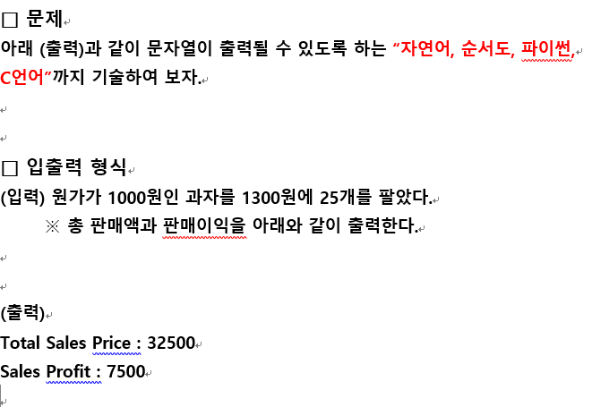

# 20201116-Flowchart



---

## 순서도

```
(Start)
 v
[price <- 1000]
 v
[sell <- 1300]
 v
[n <- 25]
 v
[total_sales_price <- sell*n]
 v
[sales_profit <- total_sales_price - price*n]
 v
/PUT "Total Sales Price : "+total_sales_pricec/
 v
/PUT "Sales Profit : "+sales_profit/ ->
 v
(End)
```

참조: [#](https://fishpoint.tistory.com/1647)
